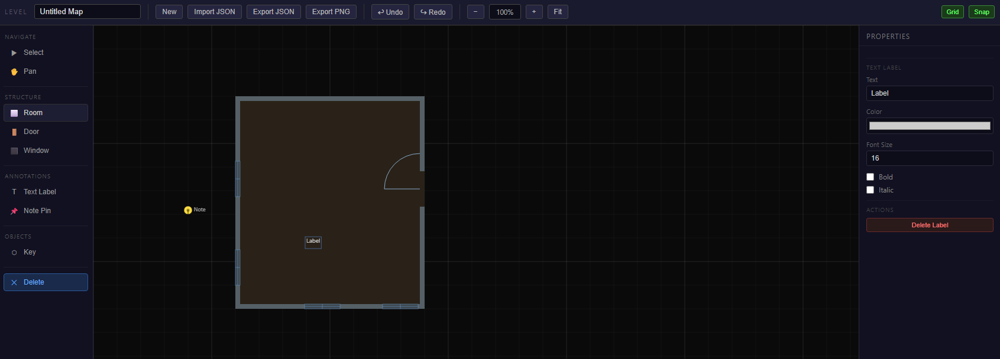

# Floor Plan Designer

> [!TIP]
> This tool is actively used during development of the horror survival game. Feature requests and bug reports are welcome via GitHub Issues and will be reviewed within 1–3 weeks.

> [!WARNING]
> ⚠️ CAUTION: This repository contains code developed with the assistance of Artificial Intelligence (AI). While functional, AI-generated code can introduce hidden bugs, security vulnerabilities, or logic flaws that may not be immediately apparent. Please thoroughly review, audit, and test all files in an isolated development environment before deployment, as this software is provided as-is and used entirely at your own risk.

## 🚀 Introduction

Floor Plan Designer is a browser-based 2D map editor built for designing interior environments for horror survival games. It runs entirely in the browser as a single self-contained HTML file — no server, no installation, no dependencies beyond an internet connection to load jQuery from CDN.



The editor is designed around a floor-plan workflow: draw rooms, place doors and windows in walls, furnish the space with interactive objects, and annotate the map with designer notes and text labels. Maps are stored as clean JSON and can be exported, shared, and re-imported at any time.

It is intended as a development aid for laying out game levels — marking enemy spawns, player starts, key and lock placements, hiding spots, light sources, and all other interactive elements — before implementing them in the actual game engine.

---

## 🔥 Features

A focused set of tools for rapid interior level layout, covering structure, objects, annotations, and persistence — without unnecessary complexity.

### 🏠 Room Drawing & Editing

Draw rooms by clicking and dragging on the canvas. Each room has independently configurable floor color, wall color, and wall thickness. Rooms can be freely moved by dragging and resized using eight grab handles on the selection border. All placement snaps to a configurable grid.

### 🚪 Doors & Windows

Switch to the Door or Window tool and hover over any wall edge to preview the opening placement. Click to commit. Doors render with an architectural arc swing indicator. Locked doors are displayed in orange. Doors and windows can be removed individually from the room's property panel.

### 🎮 Object Palette

A categorized palette of 20 object types covers the full range of horror game interactables and furniture:

| Group | Objects |
|---|---|
| Gameplay | Player Spawn, Enemy Spawn, Save Point, Key, Lock |
| Hazards | Trap |
| Interactables | Note/Document, Switch, Light Source |
| Environment | Vent, Stairs, Hiding Spot, Blood Stain |
| Furniture | Bed, Table, Chair, Desk, Locker, Cabinet, Bookshelf, Sofa, Bathtub, Toilet |

Every object can be assigned a custom label, color override, rotation, and cell size from the properties panel.

### 📌 Note Pins

Place named pins anywhere on the map. Double-clicking a pin (or clicking "Edit Note Text" in the properties panel) opens a modal where you can write freeform designer notes. Pins display their title inline on the map and can be color-coded.

### 🔤 Text Labels

Drop visible text labels directly onto the map for room names, area descriptions, or any annotation that should be readable at a glance without clicking.

### 💾 Export & Import

Maps are serialized to a clean JSON format that captures all rooms, doors, windows, objects, note pins, and labels. Export downloads a `.json` file. Import accepts pasted JSON or a file picker. The map name is included in the filename. A PNG export of the current canvas view is also available.

### 🔄 Auto-Save

The editor automatically saves the current map to `localStorage` every 30 seconds and on manual export. The last working state is restored automatically when the page is reloaded — no data is lost between sessions as long as the same browser and origin are used.

### ↩️ Undo / Redo

All destructive actions (draw, move, resize, delete, place) are tracked in an 80-step history stack. Undo with `Ctrl+Z`, redo with `Ctrl+Shift+Z` or `Ctrl+Y`.

### ⌨️ Keyboard Shortcuts

| Key | Tool |
|---|---|
| `V` | Select / Move |
| `H` | Pan |
| `R` | Draw Room |
| `D` | Door |
| `W` | Window |
| `O` | Place Object |
| `T` | Text Label |
| `N` | Note Pin |
| `E` | Erase / Delete |
| `Delete` / `Backspace` | Delete selected |
| `Ctrl+Z` | Undo |
| `Ctrl+Shift+Z` / `Ctrl+Y` | Redo |
| `Escape` | Deselect |
| `Alt + Drag` | Pan canvas |
| `Scroll Wheel` | Zoom in / out |

---

## 🗒️ Requirements

No server-side requirements. The editor runs entirely in the browser.

| Requirement | Value |
|---|---|
| Modern Browser (Chrome, Firefox, Edge, Safari) | Required |
| JavaScript enabled | Required |
| Internet connection (CDN for jQuery) | Required on first load |
| Local storage enabled | Required for auto-save |
| Screen resolution | 1280×720 minimum recommended |

---

## 🛠️ Usage

### 🌐 GitHub Pages (Recommended)

The editor is hosted via GitHub Pages directly from the `docs/` folder of this repository. No installation required — open the link in any modern browser:

[https://bugfishtm.github.io/floor-plan-designer/](https://bugfishtm.github.io/floor-plan-designer/)

### 📄 Local File

Download `docs/index.html` from this repository and open it directly in your browser. Everything is self-contained in that single file.

---

## ✏️ Adding Custom Object Types

New object types can be added by editing two sections of `docs/index.html`.

### Step 1 — Register the type

Add an entry to the `OBJ_TYPES` object (around line 275):

```javascript
my_object: { label: 'My Object', color: '#aa44ff', group: 'Environ' },
// With a custom default size in grid cells:
my_object: { label: 'My Object', color: '#aa44ff', group: 'Environ', w: 2, h: 1 },
```

This alone is sufficient. The object will appear in the palette immediately with a colored background and a `?` placeholder icon.

Available groups: `Gameplay`, `Hazards`, `Interact`, `Environ`, `Atmos`, `Furniture`. New group names are created automatically.

### Step 2 — Draw a custom icon (optional)

Add a `case` to the `switch` block inside `drawObjIcon()` (around line 674). Use `cx` and `cy` as the center point and `s` as the size scale factor:

```javascript
case 'my_object':
  c.strokeStyle = 'rgba(0,0,0,0.6)';
  c.lineWidth = s * 0.1;
  c.beginPath();
  c.arc(cx, cy, s * 0.6, 0, Math.PI * 2);
  c.stroke();
  break;
```

The canvas context `c` is available with full 2D API access. Skip this step if a colored box with a label is sufficient.

---

## 📁 Repository Structure

| Path | Description |
|---|---|
| .git/ | Internal file, can be ignored. |
| .github/ | Internal file, can be ignored. |
| docs/ | Folder served by GitHub Pages. Contains the editor. |
| docs/index.html | The complete level designer application — single self-contained HTML file. |
| [README.md](README.md) | This readme file. |
| [LICENSE.md](LICENSE.md) | License file. |

---

## 💬 Support Channels

If you encounter any issues or have questions while using this software, feel free to contact us:

- **GitHub Issues** is the main platform for reporting bugs, asking questions, or submitting feature requests: [https://github.com/bugfishtm/floor-plan-designer/issues](https://github.com/bugfishtm/floor-plan-designer/issues)
- **Discord Community** is available for live discussions, support, and connecting with other users: [Join us on Discord](https://discord.com/invite/xCj7AEMmye)
- **Email support** is recommended only for urgent security-related issues: [security@bugfish.eu](mailto:security@bugfish.eu)

---

## 📢 Spread the Word

Help us grow by sharing this project with others! You can:

* **Tweet about it** – Share your thoughts on [Twitter/X](https://twitter.com) and link us!
* **Post on LinkedIn** – Let your professional network know about this project on [LinkedIn](https://www.linkedin.com).
* **Share on Reddit** – Talk about it in relevant subreddits like [r/gamedev](https://www.reddit.com/r/gamedev/) or [r/opensource](https://www.reddit.com/r/opensource/).
* **Tell Your Community** – Spread the word in Discord servers, Slack groups, and forums.

---

## 🌱 Contributing to the Project

Thank you for your interest in this project.

At this time, this repository is **not open for external contributions**.
Please do **not** submit pull requests or patches.

- Pull requests from external contributors are not accepted.
- Any unsolicited pull requests will be closed without review.
- All code in this repository is maintained by the project owner.
- By design, no third‑party code will be merged into this project via GitHub.

If you encounter a bug or have an enhancement suggestion, please check the "Issues" section of our GitHub repository or visit our official website for guidance before beginning any work on it.

---

## 🤝 Community Guidelines

We're focused on developing innovative solutions and advancing technology. By being part of this, you contribute to our progress.

Positive guidelines include being kind, empathetic, and respectful in all interactions. It is important to engage thoughtfully and offer constructive, solution-oriented feedback. Fostering an environment of collaboration, support, and mutual respect is essential.

Unacceptable behaviors include harassment, hate speech, or offensive language. Personal attacks, discrimination, or any form of bullying are not tolerated. Sharing private or sensitive information without explicit consent is strictly prohibited.

Together, we can partner to achieve common goals by following guidelines designed to promote effective collaboration and positive teamwork.

---

## 🛡️ Security Policy

I take security seriously and appreciate responsible disclosure. If you discover a vulnerability, please follow these steps:

- **Do not** report it via public GitHub issues or discussions. Instead, please contact the [security@bugfish.eu](mailto:security@bugfish.eu) email address directly.
- Provide as much detail as possible, including a description of the issue, steps to reproduce it, and its potential impact.

I aim to acknowledge reports within **2–4 weeks** and will update you on our progress once the issue is verified and addressed.

This software is provided as-is, without any guarantees of security, reliability, or fitness for any particular purpose. We do not take responsibility for any damage, data loss, security breaches, or other issues that may arise from using this software. By using this software, you agree that We are not liable for any direct, indirect, incidental, or consequential damages. Use it at your own risk.

---

## 📜 License Information

The license for this software can be found in the [LICENSE.md](LICENSE.md) file. The software may also include additional licensed software or libraries.

🐟 Bugfish
